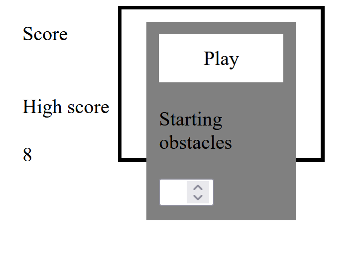

# Useless's Box Game
Author: me

Access game at https://uselesssboxgame.netlify.app/

## Table of contents
- [Description](#description)
- [Screenshot](#screenshot)
- [Technologies](#technologies)
- [Setup](#setup)
- [Credits](#credits)
- [License](#license)

## Description
Useless's Box Game is a simple game where the player tries to reach a yellow box through randomly placed obstacles. 

## Screenshot

Picture of running game on netlify by me.

## Technologies
The structure of the game is made with HTML, graphics (if you can call them such) made with CSS and functionality with Javascript and JQuery.

## Setup
Either play through link above or
Download index.html, script.js and style.css into the same folder and open the html file in a browser of your choise.

## Credits
My thanks to
https://stackoverflow.com/questions/16345870/keydown-keyup-events-for-specific-keys top anwser for key inputs
https://bost.ocks.org/mike/shuffle/ for shuffle

## License
MIT license @ Rami Nissinen